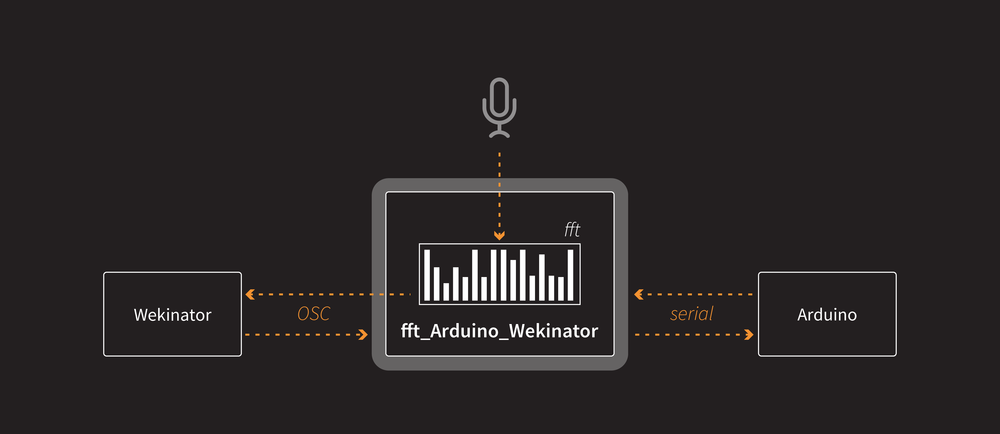
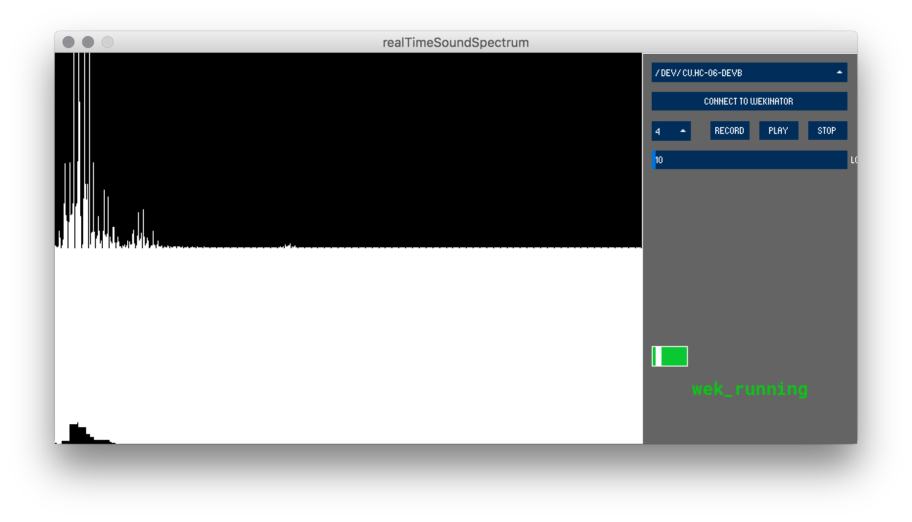

# Processing middleware to connect Arduino to Processing and [wekinator](http://www.wekinator.org/)
This piece of software was developed while [prototyping SHYBO](http://robbotti.tumblr.com/): a small robotic toy designed and developed by [Maria Luce Lupetti](marialucelupetti.com) as part of her phd research in edutaiments robotics.

The processing sketch does some very simple sound analysis and then sends the data to wekinator for realTime sound classification.

## What does it do:
- Analyze the sound of the environment
- Calculates the fft of the sounds
- sends the data to wekinator
- waits from commands from Arduino
- waits for OSC data from wekinator and forward to Arduino
- ... and much more

**dependencies:**
- minim
- oscP5controlP5
